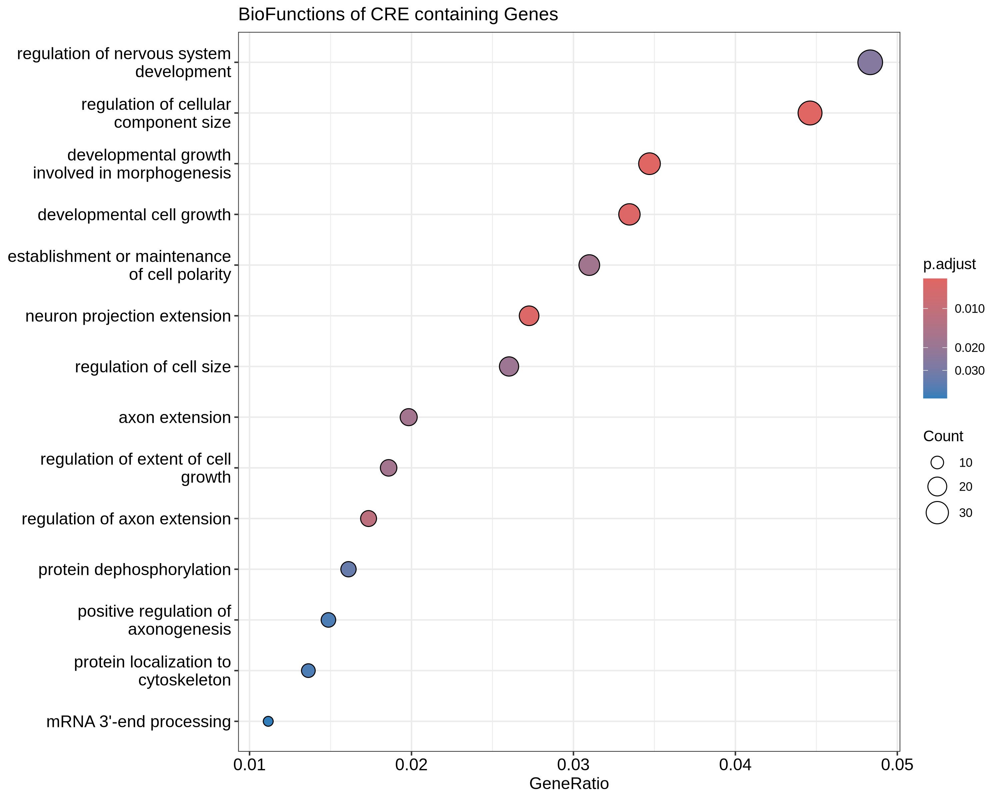

# Gene Enrichment Analysis

## Prerequisties:
Perform the steps mentioned [here](https://github.com/satyanarayan-rao>/CBB-Projects/blob/main/gene_onotology_analysis/README.md) to install the needed dependencies.

## Run it Yourself
I've added a [Makefile](Makefile) that has a default target that should run all the required commands to produce the plot.

## Results
The gene enrichment plot produced by clusterProfiler can be found in [gene_enrichment_plot.png](gene_enrichment_plot.png)

